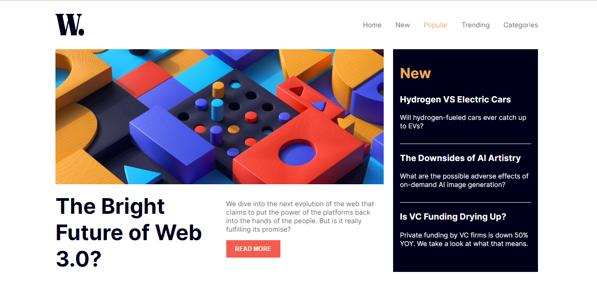

# Frontend Mentor - News homepage solution

This is a solution to the [News homepage challenge on Frontend Mentor](https://www.frontendmentor.io/challenges/news-homepage-H6SWTa1MFl). Frontend Mentor challenges help you improve your coding skills by building realistic projects. 

## Table of contents

- [Overview](#overview)
  - [The challenge](#the-challenge)
  - [Screenshot](#screenshot)
  - [Links](#links)
- [My process](#my-process)
  - [Built with](#built-with)
  - [Useful resources](#useful-resources)
- [Author](#author)

## Overview

### The challenge

Users should be able to:

- View the optimal layout for the interface depending on their device's screen size
- See hover and focus states for all interactive elements on the page
- Toggle the mobile menu.

### Screenshot

### Links

- Solution URL: [https://github.com/Khemmie-Ray/News-homepage.git](https://github.com/Khemmie-Ray/News-homepage.git)
- Live Site URL: [https://khemmie-ray.github.io/News-homepage/](https://khemmie-ray.github.io/News-homepage/)

## My process

### Built with

- Semantic HTML5 markup
- CSS custom properties
- Flexbox

### Useful resources

- [https://scrimba.com/learn/cssvariables](https://scrimba.com/learn/cssvariables) - This helped me with the setting of CSS varaiables. I really like this pattern and will use it going forward.

## Author

- Frontend Mentor - [@Khemmie-Ray](https://www.frontendmentor.io/profile/Khemmie-Ray)
- Twitter - [@Haramide](https://www.twitter.com/Haramide)
